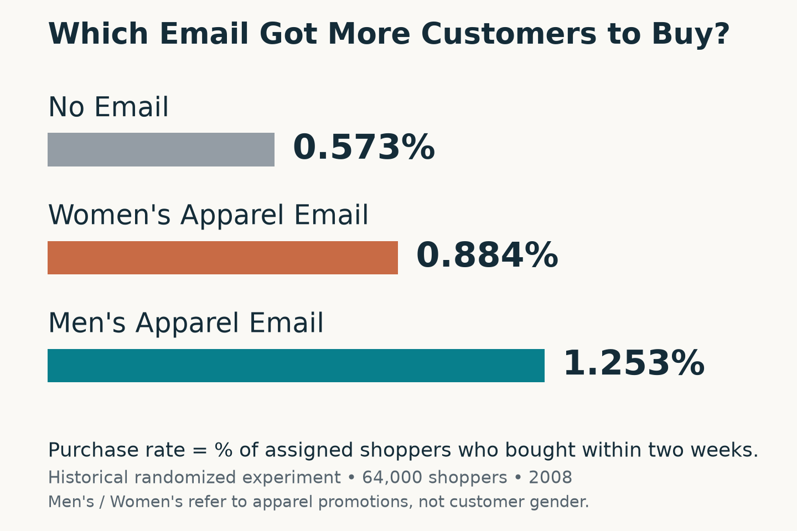
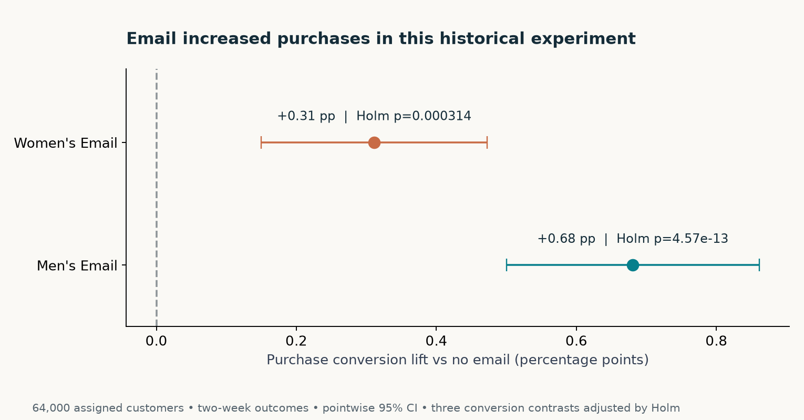
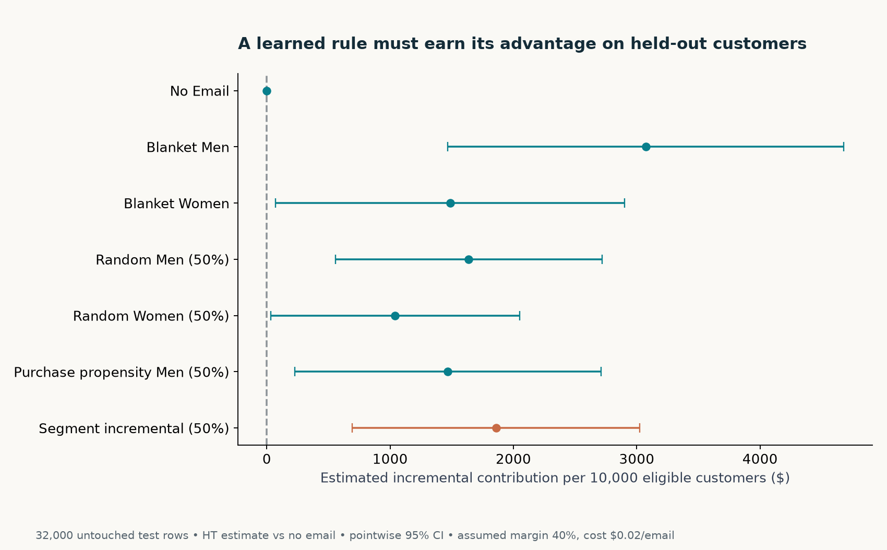

# Marketing Experimentation & Growth Strategy

**Do promotional emails actually make customers more likely to buy?**

I used data from a real experiment with 64,000 shoppers to find out which promotional emails actually increase purchases—and whether smarter targeting is worth the extra effort.

**Skills demonstrated:** Business problem framing, A/B testing, SQL/Python analysis, statistical reasoning and management decision-making.

[中文](README.zh-CN.md) · [Explore the analysis](#research-findings) · [Executive decision memo](reports/executive_memo.md)

**The problem:** Retailers spend money on promotional emails without always knowing whether those emails caused additional purchases.

**My approach:** I compared no email, a women's apparel promotion and a men's apparel promotion, then tested ways to choose which customers should receive an email when the budget is limited.

**What the data showed:** The men's apparel promotion had the highest purchase rate. There was not enough evidence that more complicated customer targeting worked better than a simpler approach using the same number of emails.

**Business recommendation:** Use the men's apparel campaign as the starting benchmark, and test a more complex targeting strategy before investing in it. This helps a retailer avoid paying for complexity that has not proved its value.

*Historical evidence: a 2008 randomized experiment, 64,000 customers, two weeks of follow-up. This project analyzes past results; no marketing campaign was implemented or business growth realized.*



**In everyday terms:** Compared with no email, the men's apparel promotion was estimated to add about **7 buying customers per 1,000 assigned shoppers** over two weeks. This is an average estimate from the historical experiment, with uncertainty—not a promise of future results. “Men's” and “Women's” name the apparel promotions, not the shoppers' gender. Purchase rate counts shoppers who bought; it is not sales revenue, profit or number of orders.

## Explore the analysis

The overview makes the business decision easy to follow. The sections below preserve the statistical evidence, budget comparisons and limits behind it.

[Research findings](#research-findings) · [Methodology](#methodology) · [Technical details and charts](#technical-details-and-decision-visuals) · [Research Notebook](notebooks/01_research.ipynb) · [Full methods](docs/methodology.md) · [Source & rights](docs/data-source.md)

## Research findings

The purchase rates above are observed group averages. The comparisons below estimate the additional purchases and spending caused by email assignment, report uncertainty, and distinguish simple campaign effectiveness from the extra value of customer targeting.

| Evidence | Finding | Decision implication |
|---|---|---|
| Primary conversion effect | Men: **+0.681 pp**, 95% CI **0.500–0.861**; Women: **+0.311 pp**, CI **0.150–0.472** | Both beat no email; Men is the stronger simple benchmark. All three conversion contrasts survive Holm correction. |
| Secondary incremental spend | Men: **+$0.770/customer**, CI **$0.485–$1.055**; Women: **+$0.424**, CI **$0.169–$0.680** | Spend created by treatment differs from total sales; margin/cost still determine contribution. |
| Independent targeting check | Segment vs random Men at 50% capacity: **+$0.055/customer**, paired CI **−$0.261–$0.372** | The learned targeting rule has **no established advantage** over a simple capacity-matched baseline. |
| Natural purchase model | Control-only logistic AUROC **0.654**; Brier improvement over constant prediction is small | Likelihood to purchase is not incremental response. Individual “would buy anyway” status is unknown. |

**Recommendation:** Use Men's Email as a benchmark in a fresh randomized pilot. Under a binding budget, test the segment rule against capacity-matched random Men's Email and retain a no-email control. Do not pay for personalization on the basis of the highest historical point estimate.



## Strategy comparison under an explicit budget

Independent **32,000-customer holdout**. Hypothetical **40% contribution margin, $0.02/email**. Estimates per **10,000 eligible customers**; these are **assumed incremental contribution**, not measured profit or realized ROI.

| Policy | Emails | Assumed contribution | Pointwise 95% CI |
|---|---:|---:|---:|
| No Email | 0 | $0 | $0–$0 |
| Blanket Men | 10,000 | $3,073 | $1,468–$4,677 |
| Blanket Women | 10,000 | $1,486 | $71–$2,901 |
| Random Men, 50% | 5,000 | $1,638 | $555–$2,720 |
| Purchase propensity Men, 50% | 5,000 | $1,468 | $226–$2,709 |
| Segment incremental, 50% | 5,000 | $1,859 | $692–$3,025 |

Blanket policies consume twice the email budget of 50% policies. Compare targeting to capacity-matched baselines; paired differences, rather than overlapping marginal intervals, assess an advantage. [All seven policies](reports/tables/policies_holdout.csv) include random Women's Email. [Paired comparisons](reports/tables/policy_paired_differences.csv) retain covariance.

A **$100 budget** at $0.02/email funds 5,000 emails for 10,000 eligible customers. The same capacity costs $500 at $0.10/email. The [108 fixed scenarios](reports/tables/scenario_grid.csv) vary capacity, cost, margin and minimum contribution threshold; sending fewer than capacity can be preferable. No policy was retuned on the holdout.

## Methodology

1. **Audit:** pinned publisher SHA-256, full schema/domain/missingness checks, preserved source rows. Repeated records are not confirmed duplicate customers.
2. **SQL + descriptive analysis:** SQLite queries for customer profiles, intention-to-treat campaign rates and historical customer groups. SQL/Python aggregates reconcile numerically.
3. **Inference:** pooled proportion tests, unpooled 95% rate intervals, Welch spend tests, outcome-wise Holm adjustment and Bonferroni sensitivity intervals. Largest standardized imbalance: 0.0169.
4. **Heterogeneity:** historical recency × merchandise cells; exploratory estimates and robust joint interactions. Six cells observed out of eight possible; the planned 16-comparison family is preserved.
5. **Prediction and policy:** interpretable control-only logistic baseline; train-only partially pooled segment spend estimates. Compare no email, constant campaigns, random allocation, natural purchase propensity and incremental targeting.
6. **Independent evaluation:** fixed treatment-stratified 50/50 split, seed 20080320; Horvitz–Thompson improvement with published 1/3 assignment probabilities and paired policy intervals. Test predictors contain historical fields only.
7. **Decision:** costs/margins remain assumptions, not fake data. Explain statistical uncertainty and business trade-offs in the [Executive Memo](reports/executive_memo.md).



## Technical details and decision visuals

| Question | Reproducible figure |
|---|---|
| Does email cause additional purchases? | [Conversion lift + intervals](reports/figures/01_conversion_lift.png) |
| How much incremental spend is observed? | [Spend contrasts](reports/figures/02_incremental_spend.png) |
| Which historical groups warrant testing? | [Exploratory heterogeneity](reports/figures/03_segment_heterogeneity.png) |
| Who is in the eligible population? | [Customer context](reports/figures/04_customer_context.png) |
| Does targeting improve the budget decision? | [Held-out strategy comparison](reports/figures/05_policy_comparison.png) |
| When should the business stop sending? | [Cost/capacity sensitivity](reports/figures/06_budget_sensitivity.png) |

All figures are generated from exported aggregates; PNG and SVG versions are included. The new purchase-rate overview is a presentation-only addition built with `python scripts/build_overview.py` from the existing verified campaign summary. It has a separate [overview manifest](reports/overview_manifest.json); the original analysis and six evidence charts are unchanged. Artifact hashes in [manifest.json](reports/manifest.json) detect drift. Code and numeric tests establish calculation correctness; rendered visual QA separately checks legibility.

## Reproduce locally

Python **3.12 or 3.13**, Git. Exact dependencies are locked; publisher rows are **not included** because redistribution permission is unverified. The downloader pins the original publisher bytes and stops on changed content. Original source is HTTP; HTTPS certificate verification failed during acquisition, and no TLS verification bypass was used.

```bash
git clone https://github.com/hql7-luo/marketing-experimentation-growth-strategy.git
cd marketing-experimentation-growth-strategy
python3.12 -m venv .venv
source .venv/bin/activate
python -m pip install -r requirements.lock.txt
python -m pip install --no-deps -e .
python -m marketing_analytics.pipeline download
python -m marketing_analytics.pipeline run
pytest -q
ruff check .
python scripts/check_publication.py
```

If the publisher is unavailable, use a lawfully acquired **exact original CSV** locally at `data/raw/hillstrom.csv` and verify SHA-256 `0e5893329d8b93cefecc571777672028290ab69865718020c78c7284f291aece`. No mirror's software license changes the publisher's data rights. Do not commit raw data or customer-level predictions. Full-reproduction evidence is recorded in [validation.md](reports/validation.md).

Execute `notebooks/01_research.ipynb` using the installed environment from the project root; it recalculates aggregate evidence without printing source customer records. **CI tests code, analytic invariants, and checked-in aggregate artifacts on Python 3.12/3.13; it does not download the source or claim a full raw-data run.** Small synthetic fixtures exist only for unit tests and are never used in the analysis.

## Limitations and what to test next

- Historical 2008 retailer, two-week horizon, only 578 buyers; no delivery, fatigue, lifetime value, actual cost or margin.
- No customer ID; 6,562 identical field records retained. Randomization mechanics cannot be independently audited.
- Monetary Men–Women difference is Holm-significant (p=0.0305) but its more conservative Bonferroni interval crosses zero; primary conversion evidence is stronger.
- Weak exploratory interaction evidence and conditional policy intervals do not establish stable individual uplift. Pointwise scenario comparisons are not a multiplicity-controlled winner search.
- Retrospective frozen plan is not prospective preregistration. Training instability and contemporary transportability require a new experiment.

**Next experiment:** equal-budget random Men vs segment incremental targeting plus no-email control, frozen rules, actual contribution costs, deliverability/unsubscribe guardrails and a management-approved minimum effect. [Full experiment recommendation](reports/executive_memo.md).

## Project map and portfolio fit

`src/marketing_analytics/` — audited ingestion, inference, models, HT evaluation, pipeline, figures · `sql/` — visible SQLite queries · `tests/` — hand calculations, exhaustive randomization unbiasedness, split/leakage/capacity invariants · `notebooks/` — executed research · `reports/` — aggregate evidence, purchase-rate overview, six detailed figures, memo · `docs/` — frozen plan, methods, source rights, portfolio distinction.

This project complements existing supply-chain planning, B2B sales workflow, enterprise RAG and customer due diligence with **marketing experimentation, statistical inference, customer strategy and constrained resource allocation**. [Existing-project audit](docs/project-positioning.md).

Source: Kevin Hillstrom, [MineThatData E-Mail Analytics and Data Mining Challenge, March 20, 2008](https://blog.minethatdata.com/2008/03/minethatdata-e-mail-analytics-and-data.html). MIT applies to original project code/documentation only, not the source dataset.
